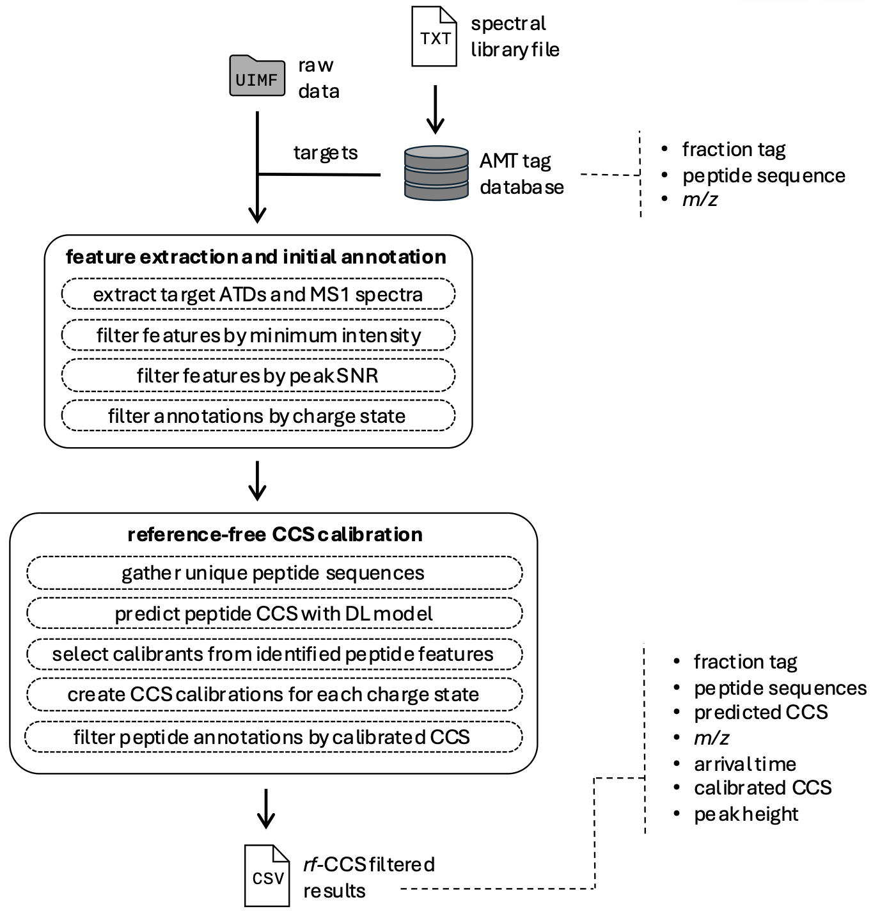

## SLIMannotator 
The `sliman` Python package fills an essential role in support of applying the SLIM high resolution IMS approach to realistic proteomics studies by automating the many and complex steps involved in the data analysis, while providing desired configurability. The package itself is highly modular with extensive documentation, enabling even greater ability to customize individual elements of the data analysis or accommodating extending functionality in the future, especially to other omics data processing.

### Overview of `sliman` functionality

The `sliman` package contains utilities for constructing and populating an AMT tag database from spectral libraries. This AMT tag database is then used as peptide targets for data processing of the SLIM IMS-MS raw data (in .UIMF format). SLIM IMS-MS data analysis consists of 1) feature extraction and initial annotation and 2) refinement of peptide annotations using a reference-free CCS (rfCCS) calibration approach, each of which consists of multiple sub-tasks. The package produces a final output in the form of a CSV results file containing information about the fraction, identified peptides, and MS feature information. 

### Additional Documentation
More detailed documentation for constructing accurate mass and time (AMT) tag database and performing data analysis and extraction from SLIM data using `sliman` are available:
- [AMT tag database construction](./docs/amt_tag_database.md)
- [SLIM data extraction and processing](./docs/data_extraction_and_processing.md)

## Information

### Citation:
_available soon_

### Contributors:
- Dylan Ross (dylan.ross@pnnl.gov)
- Aivett Bilbao (aivett.bilbao@pnnl.gov)
- Xueyun Zheng (xueyun.zheng@pnnl.gov)

### License & Disclaimer
- [license](./license.txt)
- [disclaimer](./disclaimer.txt)
