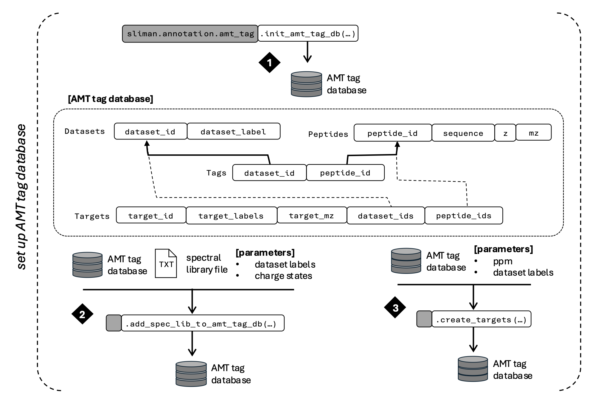

## Setting up Accurate Mass and Time (AMT) Tag database
The AMT tag database serves as a catalog of peptides, their accurate masses, and expected retention times. This catalog provides the targets that are used for data extraction and processing from SLIM data for specific primary fractions.  




### Database Schema
Each entry in the “Targets” table represents a distinct target m/z value, potentially corresponding to multiple isobaric peptides (in the “Peptides” table). The “Datasets” table tracks data files from single fractions, and the “Tags” table links sets of peptides with specific datasets. 

### `sliman` Functions

#### 1. [sliman.annotation.amt_tag.init_amt_tag_db](../src/sliman/annotation/amt_tag.py#L49)

```python
def init_amt_tag_db(amt_tag_db: str, overwrite: bool = False) -> None :
    """
    Initialize an AMT tag database
    
    Parameters
    ----------
    amt_tag_db : ``str``
        AMT tag database file
    overwrite : ``bool``, default=False
        if True, overwrite database file if it exists otherwise raise a RuntimeError
    """
```

#### 2. [sliman.annotation.amt_tag.add_spec_lib_to_amt_tag_db](../src/sliman/annotation/amt_tag.py#107)

```python
def add_spec_lib_to_amt_tag_db(amt_tag_db: str, 
                               spec_lib_file: str, 
                               dataset_labels: List[str], 
                               charge_states: List[int]
                               ) -> None :
    """
    Add a spectral library (output from: ???) to the AMT tag database

    Takes all unique peptide sequences from the selected Dataset labels and recomputes
    m/zs for all of the specified charge states. Resulting targets are stored in the 
    AMT tag database file.

    Parameters
    ----------
    amt_tag_db : ``str``
        AMT tag database file
    spec_lib_file : ``str``
        Input spectral library file (output from: ???)
    dataset_labels : ``list(str)``
        list of dataset labels to include from the input spectral library
    charge_states : ``list(int)``
        list of charge states to include, these are all recomputed from the +1 m/z
        that is included in the spectral library
    """
```

#### 3. [sliman.annotation.amt_tag.create_targets](../src/sliman/annotation/amt_tag.py#188)

```python
def create_targets(amt_tag_db: str,
                   ppm: float,
                   sel_dsets: List[str],
                   clear_targets: bool = False,
                   ) -> None :
    """
    Create targets used for data analysis by combining peptides having m/z within 
    a specified PPM. Each target has a target_id, a set of (sequence, z) for 
    corresponding peptides as labels, mz, and all associated peptide IDs. Targets are 
    created from peptides from selected datasets

    Parameters
    ----------
    amt_tag_db : ``str``
        AMT tag database file
    ppm : ``float``
        ppm threshold for combining peptides by m/z
    sel_dsets : ``list(str)``
        list of selected dataset labels to create targets from
    clear_targets : ``bool``, default=False
        if True, then clear out the Targets table in the database before starting
    """
```
