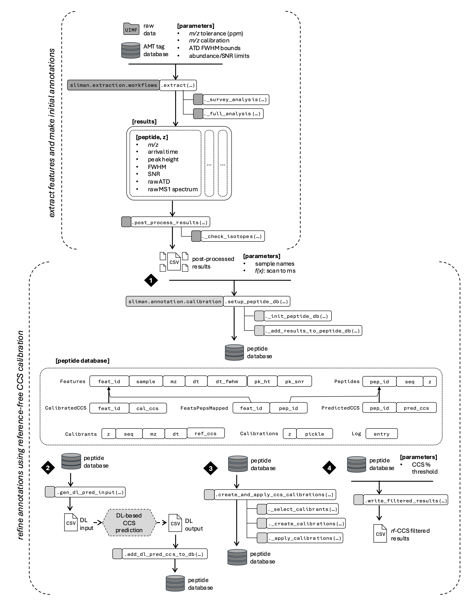

## Performing SLIM Data Extraction and Processing
The process is broken into two high-level steps: feature extraction and annotation refinement. Feature extraction from raw data (UIMF format) is performed from targets in the AMT tag database, producing a set of extracted features with preliminary peptide annotations. In the annotation refinement stage, the initial results are added into a specialized peptide database (1) that tracks metadata including CCS calibration information in addition to the features and peptide annotations. A DL-based CCS prediction method is used to assign predicted CCS values to putative peptide annotations (2), then calibrated CCS is applied to the putative peptide annotations (3) using a reference-free CCS calibration strategy. Finally, CCS-based filtering is applied to the features and they are written to a CSV file (4) to produce the final results.



### Feature extraction and initial peptide annotations

#### [sliman.extraction.workflows.extract](../src/sliman/extraction/workflows.py#L252)

```python
def extract(uimf: str, 
            amt_tag_db: str,
            sel_dsets: List[str],
            min_tmz: float,
            max_tmz: float,
            mz_ppm: float, 
            frame_mod: int, 
            scan_mod: int,
            min_peak_ht: float, 
            min_peak_fwhm: float, 
            max_peak_fwhm: float,
            min_dist: float, 
            i_min: float, 
            full_min_psnr: float,
            mz_cal_params: Optional[Tuple[float, float]] = None
            ) :
    """
    Parameters
    ----------
    uimf : ``str``
        path to UIMF file
    amt_tag_db : ``str``
        AMT tag database 
    sel_dsets : ``list(str)``
        list of selected dataset labels to get targets from
    min_tmz : ``float``
    max_tmz : ``float``
        min/max m/z range for targets
    mz_ppm : ``float``
        m/z tolerance for ATD selection, in ppm
    frame_mod : ``int``
        determines how densely the frames are sampled in survey data
        1 in {frame_mod} frames are selected
    scan_mod : ``int``
        determines how densely the arrival time (scans) is sampled in survey data
        1 in {scan_mod} scans are selected
    min_peak_ht : ``float``
    min_peak_fwhm : ``float``
    max_peak_fwhm : ``float``
        ATD peak fitting parameters
    min_dist : ``float``
        minimum distance (in arrival time) between peaks from survey analysis
    i_min : ``float``
        minimum intensity cutoff for individual spectrum points
    full_min_psnr : ``float``
        minimum peak SNR to accept peak from full data
    mz_cal_params : ``tuple(float, float)``, optional
        apply the m/z calibration using the parameters (slope, intercept) if provided

    Returns
    -------
    extraction results
    """
```

#### [sliman.extraction.workflows.extract](../src/sliman/extraction/workflows.py#L545)

```python
def post_process_results(results, out_file):
    """ 
    post-process feature extraction results by checking isotope 
    distributions and write filtered IDs to CSV 
    """
```

### Annotation refinement using reference-free CCS calibration

#### 1. [sliman.annotation.calibration.setup_peptide_db](../src/sliman/annotation/calibration/__init__.py#L101)

```python
def setup_peptide_db(dbf: str, results: Dict[str, str], 
                     scan_to_ms_cb: Callable[[float], float], 
                     overwrite: bool = False
                     ) -> None :
    """
    Initialize peptide database and fill with putative peptide IDs from 
    post-processed analysis results

    Parameters
    ----------
    dbf : ``str``
        path to database file
    results : ``dict(str:str)``
        dict of post-processed results to include, mapping sample name to corresponding 
        results csv file name
    scan_to_ms_cb : ``func(float) -> float``
        function for mapping arrival time scans into milliseconds
    overwrite : ``bool``, default=False
        if the specified database file already exists prior to calling this function, it
        will be overwritten if this flag is set to True, otherwise a RuntimeError will
        be raised
    """
```

#### Peptide results database schema
The peptide identifications and rfCCS calibrant metadata are stored in a specialized database. The schema is defined [here](../src/sliman/annotation/calibration/_queries.py#L12).

#### 2. [sliman.annotation.calibration.gen_dl_pred_input](../src/sliman/annotation/calibration/__init__.py#L134)

```python
def gen_dl_pred_input(dbf: str, dl_input_file: str, omit_symbols: bool = True) -> None :
    """
    fetch peptide data from the database and construct input file for DL 
    CCS prediction

    .. note::
        When the ``omit_symbols`` flag is set, the symbols *, #, and @ which commonly 
        follow residues M, R, and K, respectively, as the DL model cannot handle these. 
        This will impart a slight mismatch between the sequence represented in the DL 
        input (and output) and what is stored in the peptide database, but only the 
        peptide ID is used to assign the predicted values so that is ok. The other thing 
        is that these symbols do represent chemical modifications to the peptide at the 
        specified residues, therefore omitting them will probably introduce some amount 
        of error in the predicted CCS value from the DL model. We are assuming that this 
        effect is very small, and the value of having the predicted CCS values for these 
        entries outweighs the drawbacks of potentially introducing small errors in the 
        predicted CCS values from omission of these modifications.

    Parameters
    ----------
    dbf : ``str``
        path to database file
    dl_input_file : ``str``
        path to save the DL input file (a CSV)
    omit_symbols : ``bool``, default=True
        if True, omit the symbols *, #, and @ which commonly follow residues M, R, and K, 
        respectively, as the DL model cannot handle these.
    """
```

#### 3. [sliman.annotation.calibration.create_and_apply_ccs_calibrations](../src/sliman/annotation/calibration/__init__.py#L347) 

```python
def create_and_apply_ccs_calibrations(dbf: str, zs: List[int], seed: int = 42069) -> None :
    """
    Create CCS calibrations for each charge state present in the peptide
    database, then use them to generate calibrated CCS values. Intermediate
    information like the selected calibrants and individual calibration objects 
    are all stored within the database along with the calibrated CCS values. 

    Parameters
    ----------
    dbf : ``str``
        path to database file
    """
```

#### 4. [sliman.annotation.calibration.write_filtered_results](../src/sliman/annotation/calibration/__init__.py#L347) 

```python
def write_filtered_results(dbf, filtered_results_file, ccs_percent_threshold):
    """
    write rfCCS filtered peptide IDs to CSV

    Parameters
    ----------
    dbf : ``str``
        path to database file
    """
```
